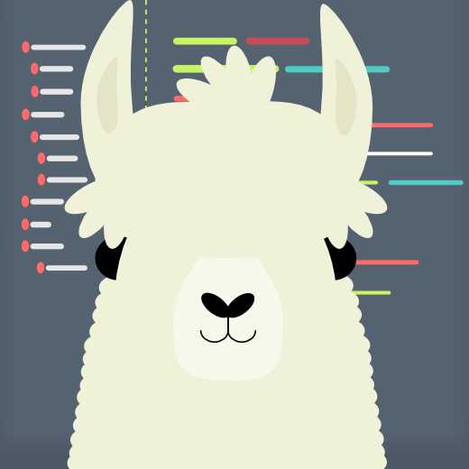
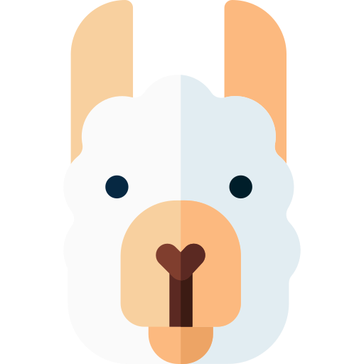
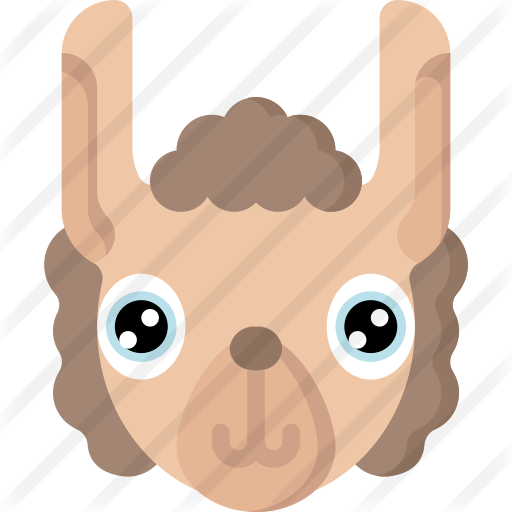
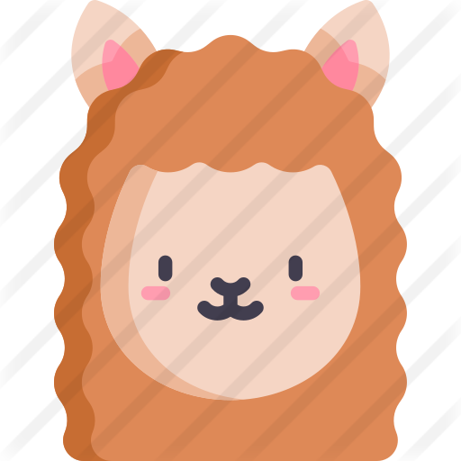
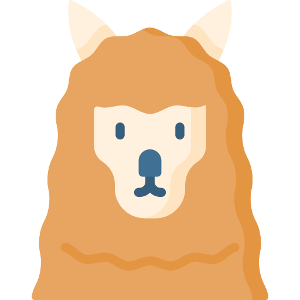
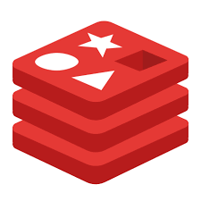

[![Contributors][contributors-shield]][contributors-url]
[![Forks][forks-shield]][forks-url] 
[![Stargazers][stars-shield]][stars-url]
[![Issues][issues-shield]][issues-url]
[![MIT License][license-shield]][license-url]

<!-- PROJECT LOGO -->
 

  

  <h3 align="center">LAMA WALLET PROJECT</h3>

  

    An awesome online wallet API created by CoStyle Studio
     
    <a href="https://github.com/RomanKonopelko/CoStyle_Backend"><strong>Explore the docs »</strong></a>
     
     
    <a href="https://costyle-wallet-app.herokuapp.com/api-docs/">View SWAGGER docs</a>
    ·
    <a href="https://github.com/RomanKonopelko/CoStyle_Backend/issues">Report Bug</a>
    ·
    <a href="https://github.com/RomanKonopelko/CoStyle_Backend/issues">Request Feature</a>
  

<!-- TABLE OF CONTENTS -->

  
Table of Contents

  <ol>
   <li>
      <a href="#team">Lama Team</a>
      <ul>
    <li>
      <a href="#about-the-project">About The Project</a>
      <ul>
        <li><a href="#built-with">Built With</a></li>
      </ul>
    </li>
    <li><a href="#roadmap">Roadmap</a></li>
    <li><a href="#contributing">Contributing</a></li>
    <li><a href="#license">License</a></li>
    <li><a href="#contact">Contact</a></li>
  </ol>

<!-- ABOUT THE PROJECT -->

## Lama Team

# Backend

**Roman-Teamlead**

[![Linkedin][linkedin]](https://www.linkedin.com/in/roman-konopelko-b78668189/)
[![Git][git]](https://github.com/romankonopelko)

# Frontend

**Katya -Scrum Master**

[![Linkedin][linkedin]](https://www.linkedin.com/in/katerynalutska/)
[![Git][git]](https://github.com/katerynalutska)

-Lama UI team:

**Jenya -Boss of the React**

[![Linkedin][linkedin]](https://www.linkedin.com/in/roman-konopelko-b78668189/)
[![Git][git]](https://github.com/evgenmag)

**Sanya aka Huracan -Sass master**

[![Linkedin][linkedin]](http://linkedin.com/in/alexander-huracan-1b8229119/)
[![Git][git]](https://github.com/huracan22505)

**Sveta -UI women**

[![Linkedin][linkedin]](https://www.linkedin.com/in/svetlanakhvastova/)
[![Git][git]](https://github.com/svetlanakhvastova)

**Ravshan -Site Adaptivator 2000**

[![Linkedin][linkedin]](https://www.linkedin.com/in/ravshanmahmudov/)
[![Git][git]](https://github.com/rmhmdv)

**Andrey -Redux brain**

[![Linkedin][linkedin]](https://www.linkedin.com/in/andrey-kulba-50503ab3/)
[![Git][git]](https://github.com/andriikulba)

## About The Project

[![Lama Wallet home][home-screen]](https://costyl-swiss-wallet.netlify.app/home)

We created an Lamawesome online Wallet application, that easly will help you to
keep an eye on your income and money consumptions. Light and fluff UI and usage
that easy to understand!

If having any issues with our API, Lama Manager is always ready to help.

[![Lama Wallet transactions][transactions-screen]](https://costyl-swiss-wallet.netlify.app/home)

We implemented full CRUD logic to operated with the transactions:

_Easly create!_

_Easly read!_

_Easly update!_

_Easly delete!_

[![Lama Wallet balance][balance-screen]](https://costyl-swiss-wallet.netlify.app/home)

All the transactions are syncronized, so you can notice all the balance changes
after the transaction has been made. You can see the current user balance, and
the staged balance caches right after the transaction was created!

### Built With

This section should list any major frameworks that you built your project using.
Leave any add-ons/plugins for the acknowledgements section. Here are a few
examples.

## Backend

Talking about what is going on under the skin?

Our backend has two databases connected! We decided to use MongoDB to organize
user and transactions collections. And Redis cache database to work with our
tokens.

By the way. Security is also matters. So using the power of Redis we made token
caching and blacklisting system that helps us to prevent using twice the same
tokens in the system.

## SWAGGER docs

  

If you wonder how to work with our API check the SWAGGER docs by clicking the
logo above!

## Roadmap

See the [open issues](https://github.com/RomanKonopelko/CoStyle_Backend/issues)
for a list of proposed features (and known issues).

## License

Distributed under the MIT License. See [`lICENSE`][license-url] for more information.

<!-- CONTACT -->

## Contact
  
Project Link: [https://lama-wallet.netlify.app](https://lama-wallet.netlify.app)

<!-- ACKNOWLEDGEMENTS -->

<!-- MARKDOWN LINKS & IMAGES -->

[home-screen]: assets/screenshots/home.png
[balance-screen]: assets/screenshots/balance.png
[lama-screen]: assets/screenshots/lama.png
[transactions-screen]: assets/screenshots/transactions.png
[contributors-shield]:
  https://img.shields.io/github/contributors/RomanKonopelko/CoStyle_Frontend.svg?style=for-the-badge
[contributors-url]:
  https://github.com/RomanKonopelko/CoStyle_Frontend/graphs/contributors
[forks-shield]:
  https://img.shields.io/github/forks/RomanKonopelko/CoStyle_Frontend.svg?style=for-the-badge
[forks-url]: https://github.com/RomanKonopelko/CoStyle_Frontend/network/members
[stars-shield]:
  https://img.shields.io/github/stars/RomanKonopelko/CoStyle_Frontend.svg?style=for-the-badge
[linkedin]: https://img.shields.io/badge/linkedin-social-blue
[git]: https://img.shields.io/badge/GIT-repo-lightgrey
[stars-url]: https://github.com/RomanKonopelko/CoStyle_Frontend/stargazers
[issues-shield]:
  https://img.shields.io/github/issues/RomanKonopelko/CoStyle_Frontend.svg?style=for-the-badge
[issues-url]: https://github.com/RomanKonopelko/CoStyle_Frontend/issues
[license-shield]:
  https://img.shields.io/github/license/RomanKonopelko/CoStyle_Backend.svg?style=for-the-badge
[license-url]:
  https://github.com/RomanKonopelko/CoStyle_Backend/blob/master/LICENSE.txt
